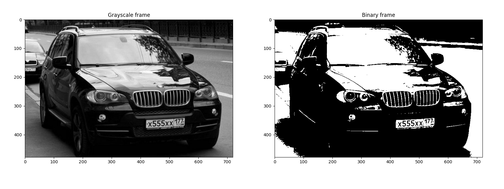
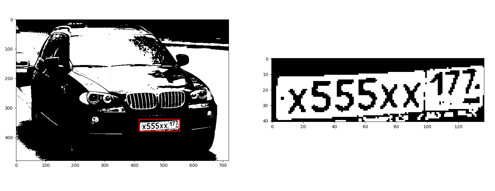
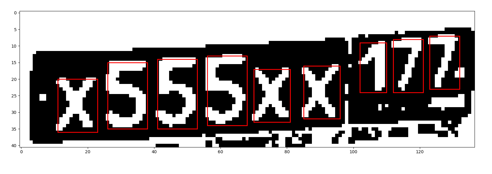

# PlateDetector

An app to recognize car licence plate and its content
Characters recognition is based on opencv and LSVC(sklearn)

# An example

# Setup
You have to download weights:

https://www.kaggle.com/achrafkhazri/yolo-weights-for-licence-plate-detector
and move them to plate_detector folder

pip install requirements.txt

place Your paths as first parameter of static method called "CharacterPredicter"

run: 
python3 main.py
